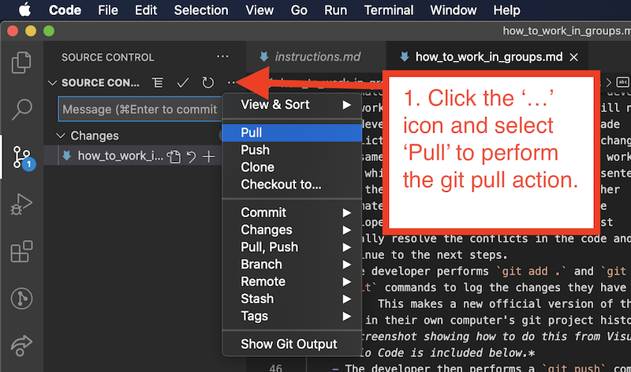

# How To Work In Groups

There are three workflows groups can work together on a project:
1. With one person as the dedicated code writer, and the others act as advisors and helpers in real-time, looking at a shared view of the code editor and discussing the code as the dedicated writer writes it.
1. With all team members actively writing the code in real-time, using a real-time collaborative code writing tool so each developer sees the others' contributions live.
1. With everyone involved writing the code, but doing so asynchronously, following a specific git-enabled workflow that helps avoid common conflicts such as one developer accidentally overwriting another's work.

The decision which workflow to use is up to each team, but we will discuss each process below.

## Dedicated code writer
This is a variation of the idea of a "[pair programming](https://en.wikipedia.org/wiki/Pair_programming)", where programmers work in teams of two, with one as the dedicated code writer.  All team members are equally involved in discussing the code and deciding upon its direction, but only one actually writes it.

This workflow can be especially helpful if the programmer writing the code is less experienced than the others advising, although it is not limited to such scenarios.

When team members are in the same room, the non-writing members can simply look over the shoulder of the writer.  In remote teams, simple screen sharing software suffices to show everyone the code as it is being written and using audio chat to discuss.

## Real-time code collaboration
In this workflow, all team members have access to the code and modify it together in a real-time code collaboration environment.  

The [Live Share Extension Pack for Visual Studio Code](https://marketplace.visualstudio.com/items?itemName=MS-vsliveshare.vsliveshare-pack), and similar tools, allow multiple programmers to connect to a single collaborative editing environment where they can all simultaneously work on the code.  Each programmer sees in real-time the changes the other programmers are making, and they use audio chat to discuss the code as they work on it.

See a video tutorial on [using Visual Studio Code's Live Share Extension Pack](https://www.youtube.com/watch?v=I7TZdfSaAhk)

## Asynchronous code collaboration
For teams where meeting in real-time, either virtually or in person, is not feasible, a specific git-enabled workflow can allow team members to collaborate asynchronously while not overwriting each others' work accidentally.

### The big idea
Teams set up a shared repository of code on a web site such as github.com.  Whenever a teammate begins working on the code, they first download the latest code from the repository on github.com, and then begin their changes. 

It is agreed that whenever a team member makes significant changes to the code on their own computers, they will upload their changes to the shared repository on github.com so that others can see the changes and download them.

### Project setup
To begin, the remote repository on github.com is created and each teammate makes a copy of it on their own computers using the `git clone` command either from the command line, or in a git-enabled code editor such as Visual Studio Code.

See a video tutorial on [how to clone a repository from github.com](https://www.youtube.com/watch?v=axcny0o1NYo).

Developers should share notes, thoughts, and discussion about the code in a chat system, such as Slack, Discord, Gitter, or other.

### Workflow
The following is an outline of the steps a developer would take each time they work on the code.  The `git` commands are indicated below, although a `git`-enabled code editor, such as Visual Studio Code, can perform these commands at the click of a button, rather than from the command line.
1. Perform a `git pull` operation to download the latest version of the code from the shared repository on github.com.  This way the developer always starts working with the latest version of the code, including any changes other teammates have done.
1. The developer works on the code on their own computer.
1. Whenever the developer has made significant changes and wants to share those with the team (at least once per session working on the code), the developer performs three steps:
    - `git pull` to download any changes other teammates have made to the code while the developer was working.  See a screenshot of [how to do this from within Visual Studio Code](#git-pull) below. 
    - It is possible in some cases that git will notify the developer that other teammates have made conflicting changes to the code (such as changes to the same lines of code that the developer worked on), in which case the developer will be presented with their own changes and the changes other teammates have made that conflict with the developer's changes, and the developer must manually resolve the conflicts in the code and continue to the next steps.  See a video tutorial [how to resolve merge conflicts within Visual Studio Code](https://www.youtube.com/watch?v=lXPYqVjyqHM).
    - The developer performs `git add .` and `git commit` commands to log the changes they have made.  This makes a new official version of the code in their own computer's git project history.  See a screenshot of [how to do this from within Visual Studio Code](#git-add-commit-and-push) below.
    - The developer then performs a `git push` command to upload those changes to github.com so that other teammates can access the latest code. See a screenshot of [how to do this from within Visual Studio Code](#git-add-commit-and-push) below.

## Screenshots

### Git pull
A screenshot showing how to perform the `git pull` command from within Visual Studio Code.  This downloads the latest code from a remote repository to your own machine.

### Git add, commit, and push
A screenshot showing how to perform `git add .` (also known as 'staging'), `git commit`, and `git push` commands from within Visual Studio Code.   This uploads changes you have made on your own machine to a remote repository so others can download them.

